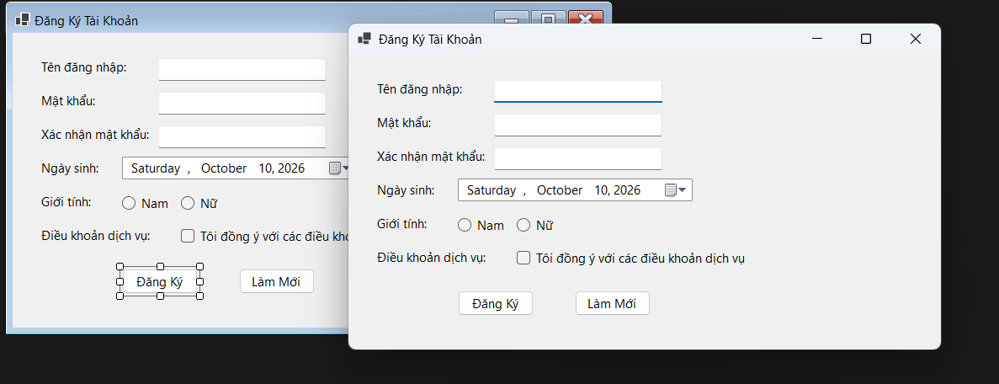
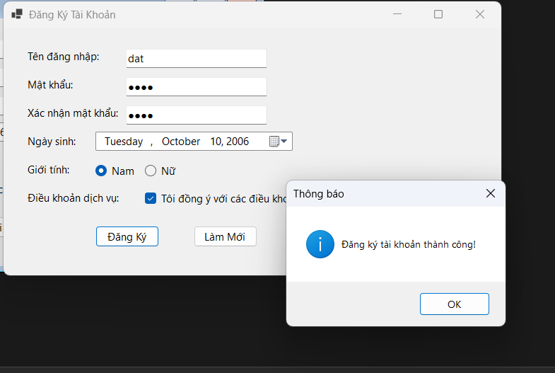
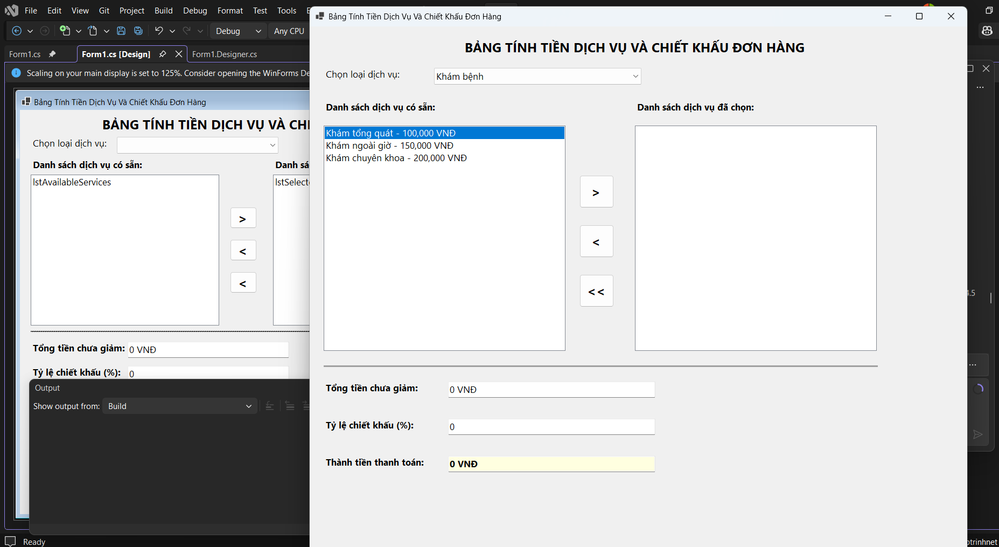
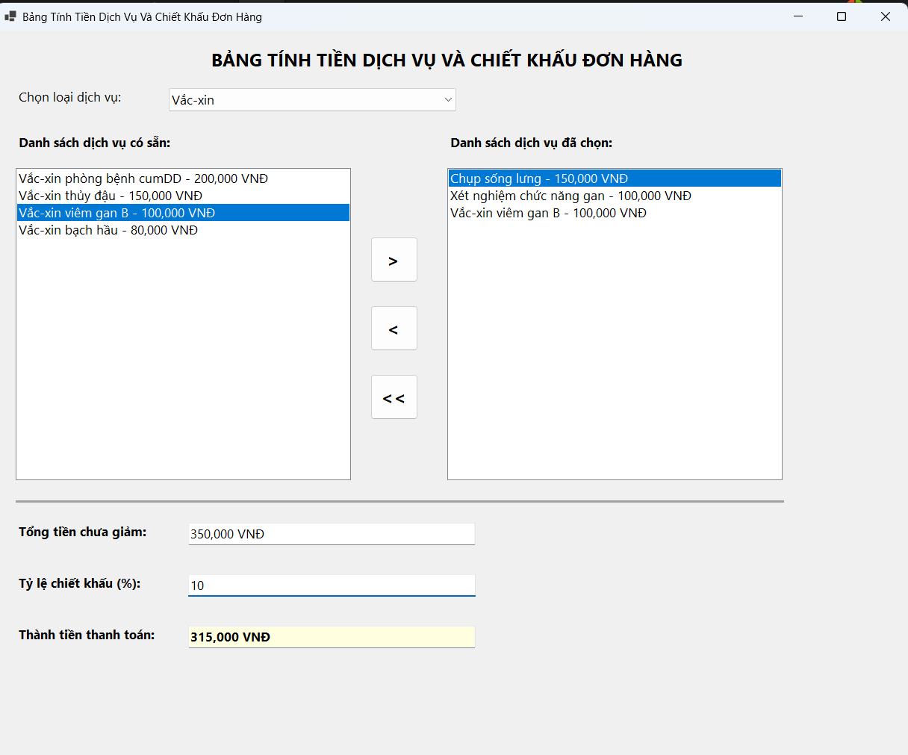
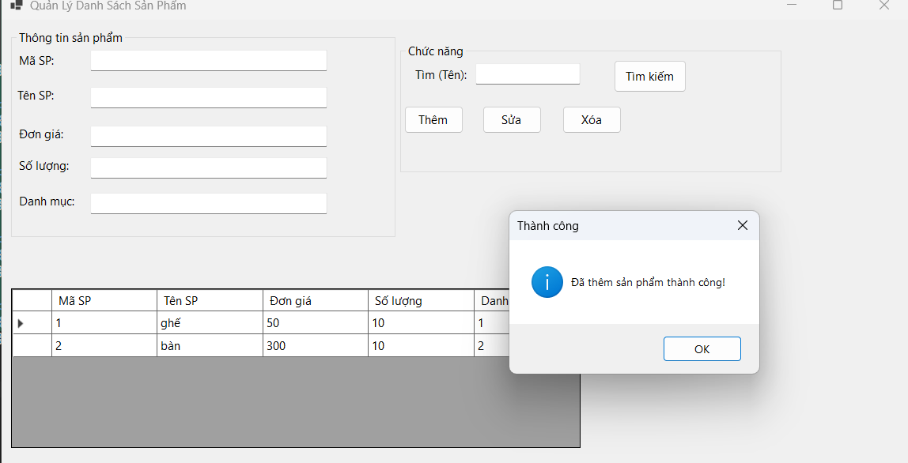
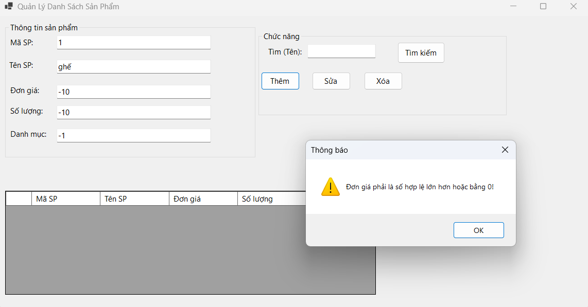
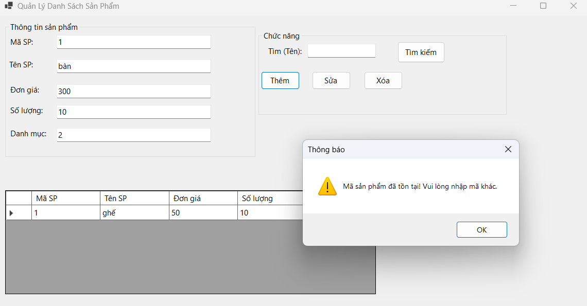
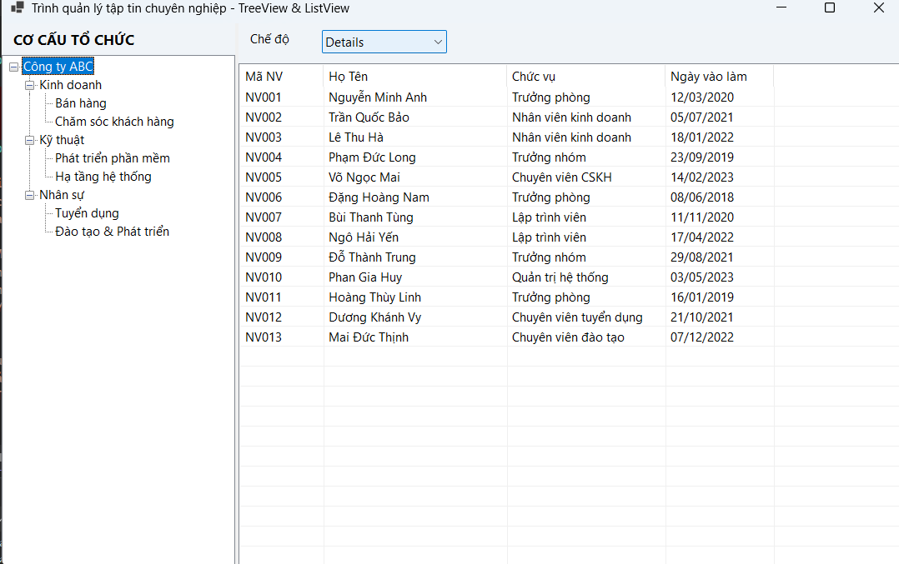
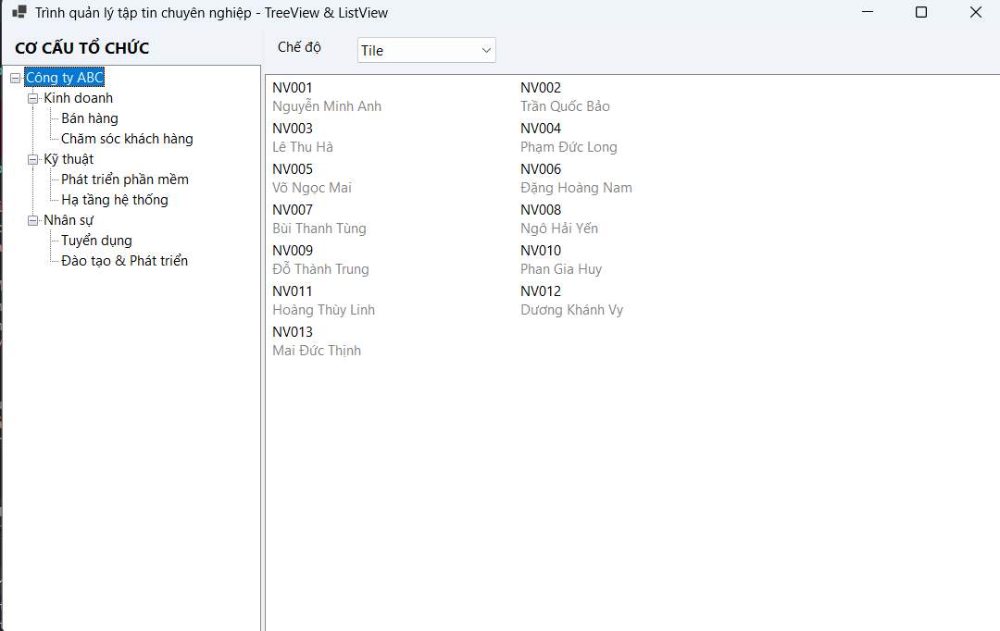

# BÁO CÁO BÀI TẬP / ĐỒ ÁN

## THÔNG TIN SINH VIÊN
- **Họ và tên:** Nguyễn Thành Đạt
- **Mã số sinh viên:** 24810340130
- **Lớp:** D19QTANM!
- **Tên môn học:** Lập trình C# / Windows Forms
- **Tên bài tập:** [LT.NET-TH-5.1-5.5]

---

## KẾT QUẢ THỰC HÀNH
###  BÀI 5.1
### 1. Ảnh màn hình Giao diện chính

### 2. Ảnh màn hình Chức năng thực thi / Kết quả

### 3. Ảnh màn hình Kiểm tra lỗi (Validation)

###  BÀI 5.2
### 1. Ảnh màn hình Giao diện chính

### 2. Ảnh màn hình Chức năng thực thi / Kết quả

### BÀI 5.3
### 1. Ảnh màn hình Giao diện chính

### 2. Ảnh màn hình Chức năng thực thi / Kết quả

### 3. Ảnh màn hình Kiểm tra lỗi (Validation)

###  BÀI 5.4
### 1. Ảnh màn hình Giao diện chính

### 2. Ảnh màn hình Chức năng thực thi / Kết quả
