# BÁO CÁO BÀI TẬP / ĐỒ ÁN

## THÔNG TIN SINH VIÊN
- **Họ và tên:** Nguyễn Thành Đạt
- **Mã số sinh viên:** 24810340130
- **Lớp:** D19QTANM1
- **Tên môn học:** Lập trình C# / Windows
- **Tên bài tập:** ÔN TẬP WINDOW FORM

---

## KẾT QUẢ THỰC HÀNH

### Bài 1
### 1. Ảnh màn hình Giao diện chính
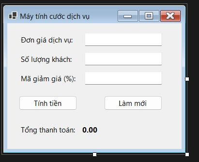
### 2. Ảnh màn hình Chức năng thực thi / Kết quả
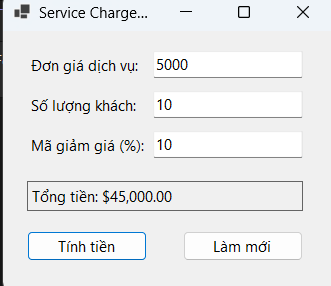
### 3. Ảnh màn hình Kiểm tra lỗi (Validation)
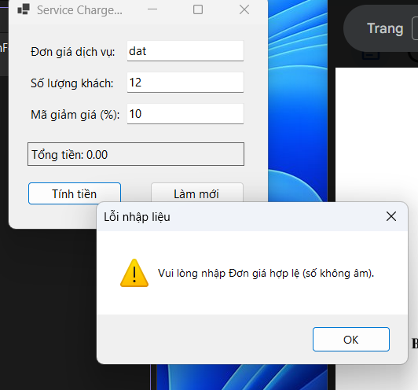

### Bài 2
### 1. Ảnh màn hình Giao diện chính
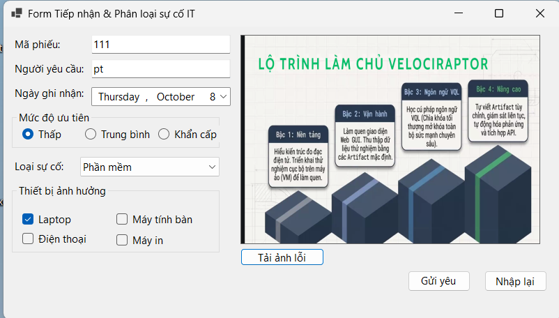
### 2. Ảnh màn hình Chức năng thực thi / Kết quả
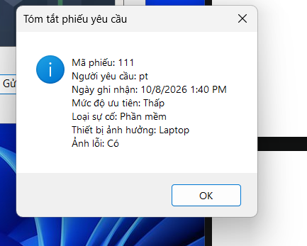
### 3. Ảnh màn hình Kiểm tra lỗi (Validation)
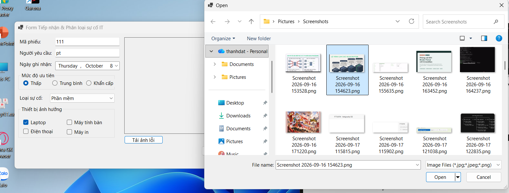
### Bài 3
### 1. Ảnh màn hình Giao diện chính
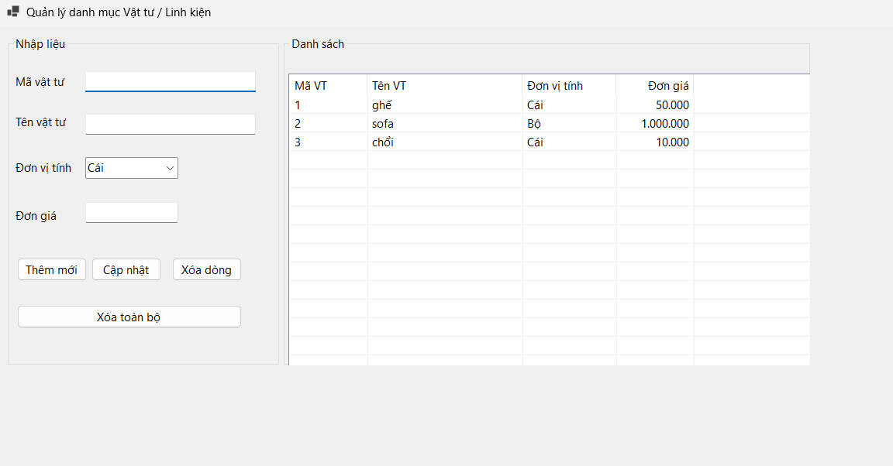
### 2. Ảnh màn hình Chức năng thực thi / Kết quả
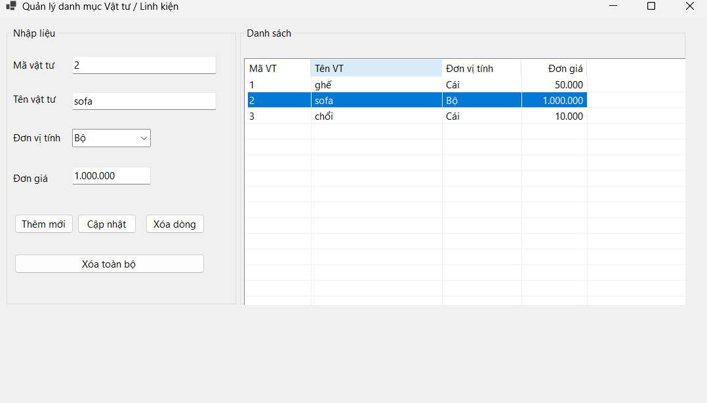

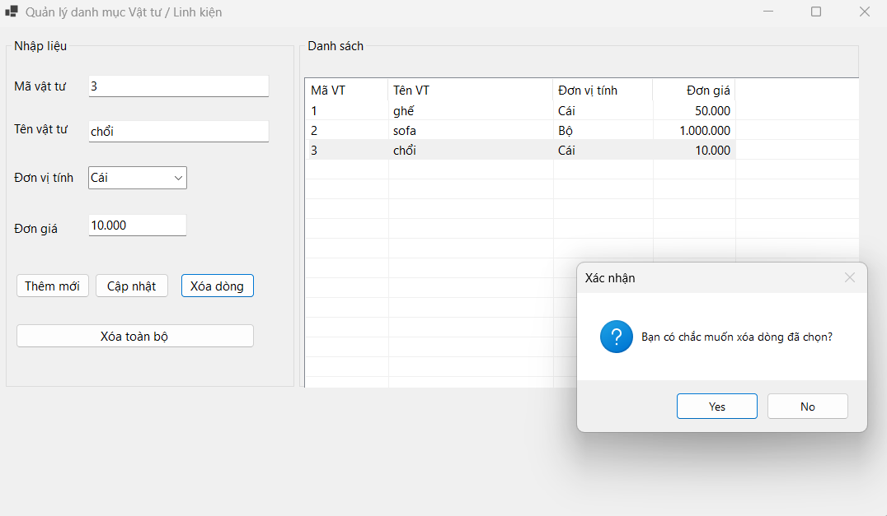

### 3. Ảnh màn hình Kiểm tra lỗi (Validation)
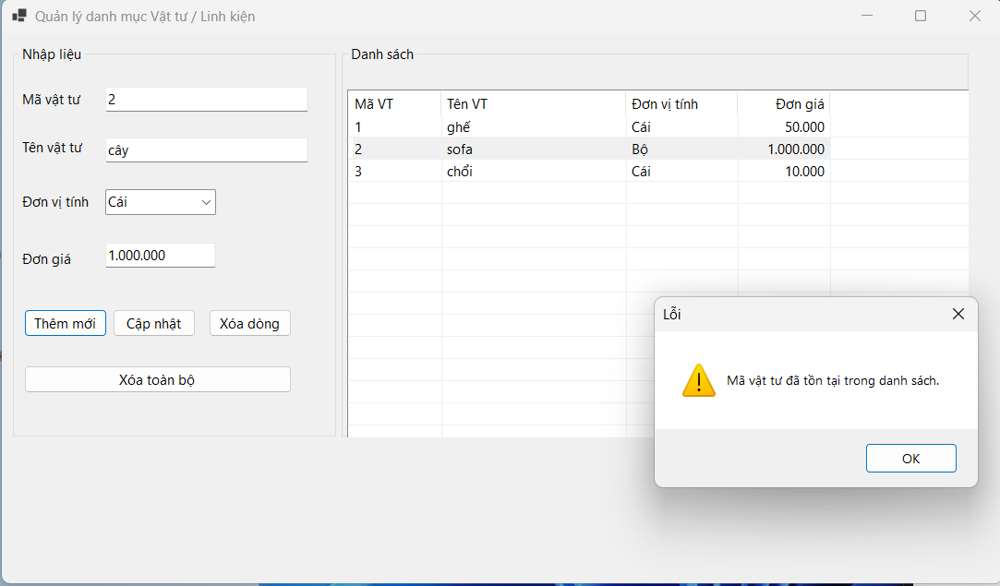
### Bài 4
### 1. Ảnh màn hình Giao diện chính
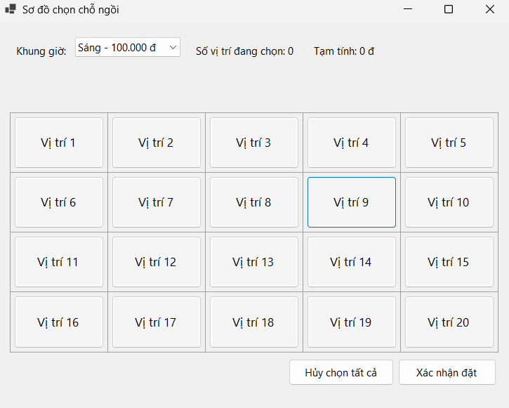
### 2. Ảnh màn hình Chức năng thực thi / Kết quả
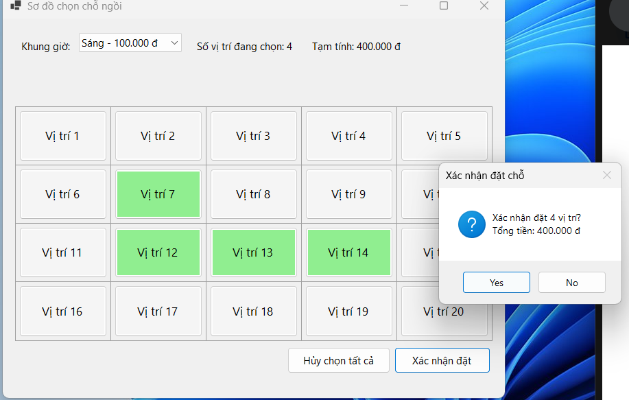

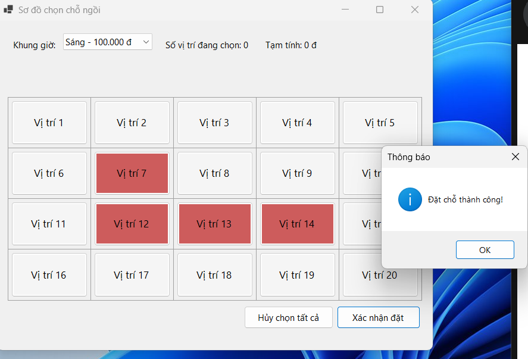
### Bài 5
### 1. Ảnh màn hình Giao diện chính
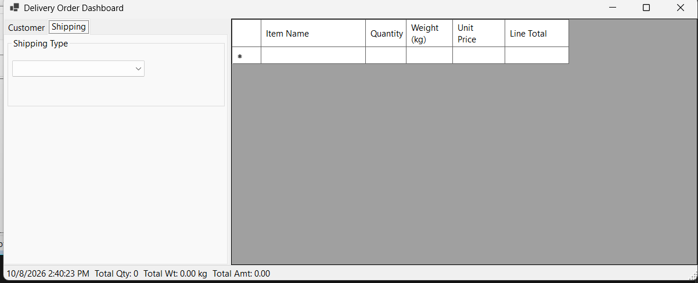
### 2. Ảnh màn hình Chức năng thực thi / Kết quả
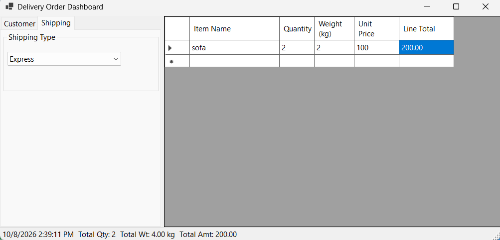
### 3. Ảnh màn hình Kiểm tra lỗi (Validation)
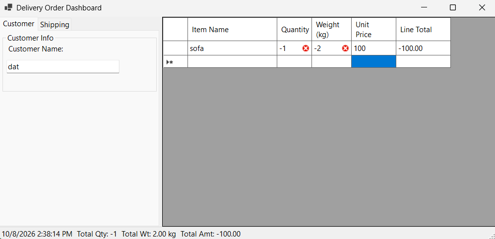

